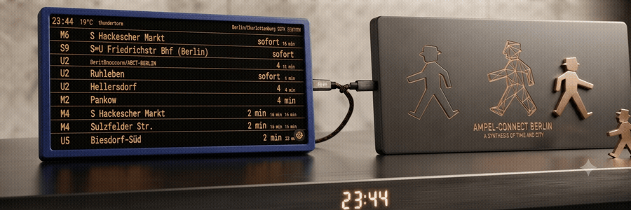
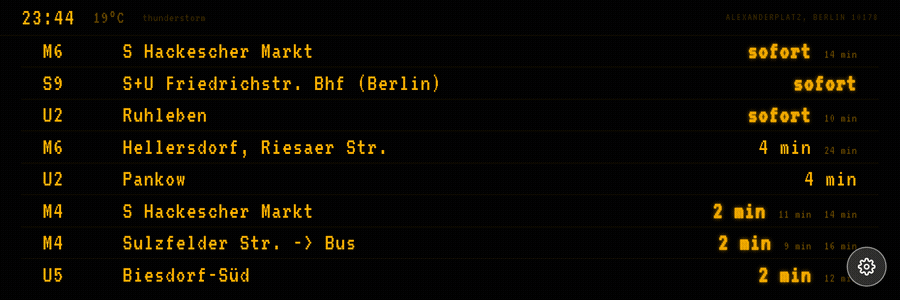
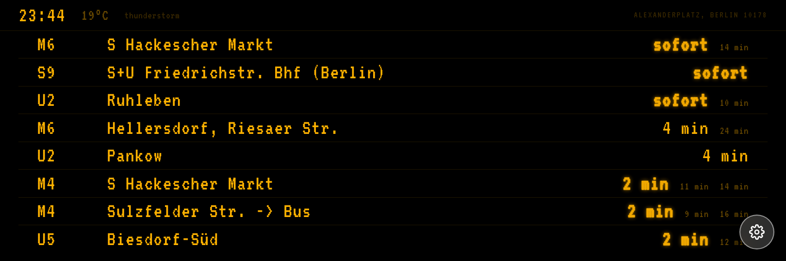
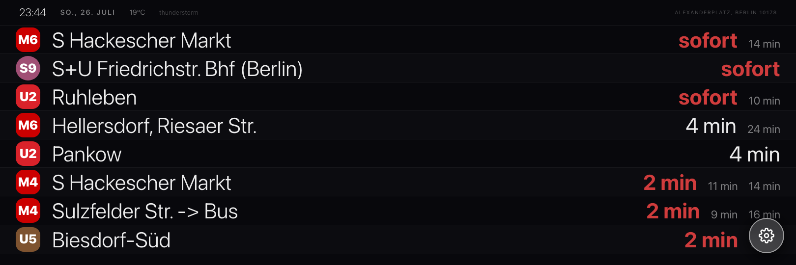
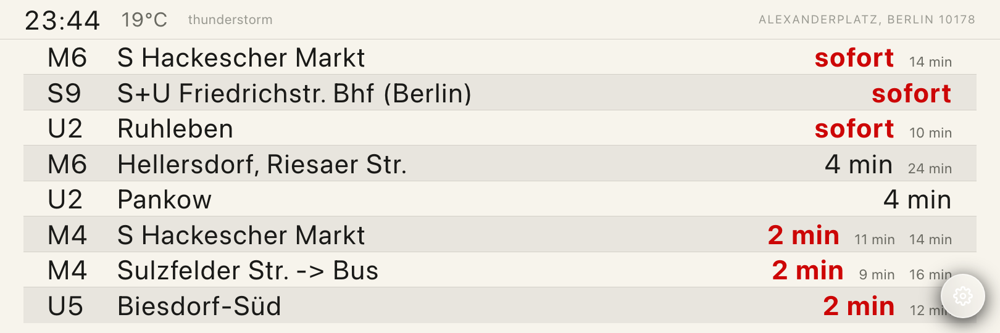
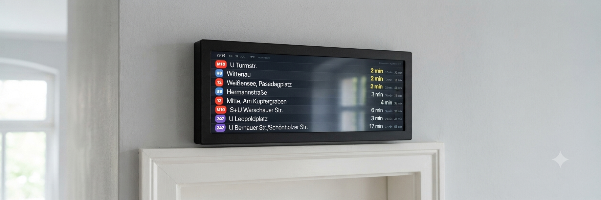
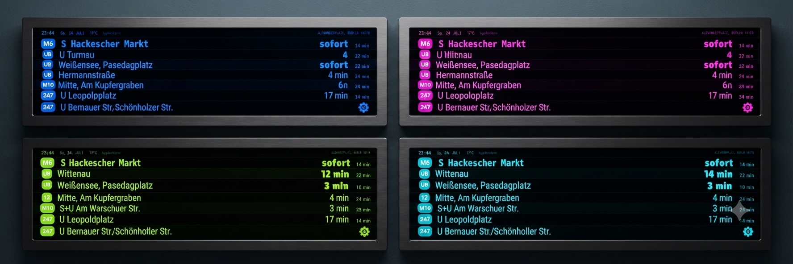

# VESTL

**Know before you go.**

VESTL is a physical product — a Raspberry Pi + screen unit designed to be mounted at the entrance of any home or apartment. Its primary purpose is one thing: **showing you when the next bus, tram, U-Bahn or S-Bahn leaves from your nearest stop.** No pulling out your phone. No unlocking. You walk past it and you know.

This repository contains the **display software** that runs on the VESTL device.

     



*AI-generated concept exploration, not a real product — illustrative only.*



*Live capture, not a mockup — same board skins available in Settings → Theme.*

<table>
<tr>
<td></td>
<td></td>
<td></td>
</tr>
</table>

## The Hardware

VESTL runs on a **Raspberry Pi** (3B+ or newer) connected to a **3:1 ultra-wide screen** — a wide, low-profile display format that fits naturally above or beside a door frame without dominating the wall. The software boots into a full-screen Chromium kiosk. No keyboard, no mouse, no interaction needed.

The **3:1 aspect ratio** is a deliberate product decision: the display is purpose-shaped for a door context. It is wide enough to show multiple transit lines side by side, and narrow enough to sit flush against a wall like a shelf or a picture frame.



*AI-generated concept render, not a photo of a built unit — illustrates the intended mounted scale and placement.*

<details>
<summary>Color theme exploration (concept renders)</summary>
<br>

</details>

### Housing

The enclosure is a core part of the product — not an afterthought. Every edition of VESTL has a housing designed to match its identity:

| Edition | Housing | Finish |
|---------|---------|--------|
| **Prototype** | 3D printed (FDM/resin) | Matte black, minimal |
| **Standard** | 3D printed, refined geometry | Painted / powder coated |
| **Collab Edition** | CNC machined aluminium or bespoke material | Anodised, brushed, raw — edition-specific |
| **Artist Drop** | Designed per collaboration | Material and finish defined by the artist |

The prototype housing is intentionally simple — clean rectangular form, flush-mounted screen, minimal bezel. The object is designed to look like it belongs on a wall, not like a DIY project.

**Planned collab editions** — artist series, clothing brand drops, limited CNC housing finishes. VESTL is both a utility object and a collectible design object.

## ✨ Software Features

**Core — transit is everything:**
- 🚇 **Live Transit Departures** — next U-Bahn / S-Bahn / Tram / Bus from the nearest stop(s), auto-detected by GPS. This is the product. Everything else supports it.
- 🚏 **Distance-first stop selection** — picks the closest stop for each high-quality mode (subway, suburban, tram) so a nearby U-Bahn and S-Bahn can appear side by side, instead of one bus stop crowding out a better station further away. Falls back to bus stops only when nothing better is nearby.
- 🪧 **Real departure board designs** — multiple board skins modeled on actual transit displays: BVG amber/yellow split-flap, official line-badge icons, S-Bahn, metro, signal, paper ticket, and more.
- 🔄 **Auto-refresh** — updates every 60 seconds, fully passive, no interaction ever needed. Briefly holds the last known departures/weather on a failed fetch instead of going blank.
- ⚡ **No backend, no API keys** — works out of the box, all data from public open APIs.

**Supporting context:**
- 📍 **GPS auto-locate + interactive map** — set your location by GPS, dragging a pin on an in-app map, or searching an address (with live suggestions), all from the Settings panel.
- 🌡️ **Weather** — temperature and condition at a glance via Open-Meteo (secondary, complements the transit info).
- 🕐 **Clock** — time display with 25+ styles, from Bauhaus to Tourbillon to Kintsugi (tertiary, ambient).
- 🎨 **Themes** — dozens of themes across Berlin landmark illustrations (U-Bahn platform, Fernsehturm, Berliner Dom, Berghain, East Side Gallery), official transit styling, and more.

## 🚀 Quick Start

### Prerequisites

- Node.js 16+ and npm
- Nothing else — no API keys, no accounts.

### Installation

```bash
git clone https://github.com/yassine12-12/vestl.git
cd vestl
npm install
npm run dev
```

Open `http://localhost:5173` in your browser.

### Set your location

Location can be set entirely from the app's Settings panel (GPS, map, or address search) and is saved to `localStorage` — no code changes needed.

To change the *default* starting location instead, edit `src/config.ts`:

```typescript
export const config = {
  MY_ADDRESS: 'Alexanderplatz, Berlin 10178',
  MY_LAT: 52.5219,
  MY_LON: 13.4132,
  SEARCH_RADIUS: 300,       // meters, for display only
  REFRESH_INTERVAL: 60000,  // ms
};
```

## 📦 Project Structure

```
vestl/
├── src/
│   ├── App.tsx                  # Root component — wires hooks, theme/board state, modals
│   ├── config.ts                # Default location + refresh interval
│   ├── userConfig.ts            # Runtime location/settings persisted to localStorage
│   ├── types.ts                 # Shared TypeScript types
│   ├── hooks/
│   │   ├── useWeather.ts        # Open-Meteo fetch, no key needed
│   │   └── useDepartures.ts     # BVG/VBB nearby-stop lookup + departures fetch
│   ├── components/
│   │   ├── BvgLayout.tsx        # Unified departure board — all skins/variants
│   │   ├── Layout.tsx           # Layout shell (clock, weather, board placement)
│   │   ├── MetroLayout.tsx, NovaLayout.tsx, PaperLayout.tsx,
│   │   │   SbahnLayout.tsx, SignalLayout.tsx, VestlBoard.tsx
│   │   ├── MiniMap.tsx          # Leaflet map for location picking
│   │   ├── SettingsModal.tsx    # Theme + Location settings panel
│   │   ├── CustomizationModal.tsx, ThemeSelector.tsx
│   │   ├── ThemeBackground.tsx  # Full-screen SVG landmark illustrations
│   │   └── clocks/              # 25+ individual clock face components
│   └── themes/                  # Theme definitions, grouped by collection
├── package.json
├── tailwind.config.js
├── tsconfig.json
└── vite.config.ts
```

## 🎨 Customization

Most customization (theme, board style, clock face, location) is done live in the app via the Settings and Customize panels — changes persist to `localStorage`.

### Change refresh interval

Edit `src/config.ts`:
```typescript
REFRESH_INTERVAL: 30000,  // 30 seconds
```

### Adding a new clock face or theme

See `AGENT_MEMORY.md` for the registration checklist — new clocks and themes must be wired into a handful of specific files to show up in the picker.

### Regenerating the demo GIF

`scripts/generate-demo.mjs` drives the running dev server with [Playwright](https://playwright.dev/) (a devDependency, only used for this), cycling through board skins via `localStorage` and screenshotting each — real live data, not a mockup:

```bash
npm run dev                     # in one terminal
node scripts/generate-demo.mjs  # in another — writes docs/frames/*.png
ffmpeg -y -framerate 1/1.4 -pattern_type glob -i 'docs/frames/frame-*.png' \
  -vf "scale=900:-1:flags=lanczos,split[s0][s1];[s0]palettegen=stats_mode=diff[p];[s1][p]paletteuse=dither=bayer" \
  -loop 0 docs/demo.gif
```

## 🏗️ Building for Production

```bash
npm run build    # type-checks then builds to dist/
npm run preview  # serve the production build locally
```

## 🖥️ Deployment

### Raspberry Pi kiosk (intended use)
Build with `npm run build`, serve `dist/` with any static file server, and point Chromium at it in kiosk mode (`chromium-browser --kiosk --incognito <url>`) via a systemd service or autostart entry.

### Vercel / Netlify
Standard static-site deploy — build command `npm run build`, output directory `dist/`. No environment variables required.

## 🛠️ Troubleshooting

**No departures showing?**
- Check that your location (Settings → Location) actually has a transit stop within the search radius.
- Try the BVG API directly in your browser: `https://v6.bvg.transport.rest/locations/nearby?latitude=<lat>&longitude=<lon>`.

**Weather not loading?**
- Check the browser console — `useWeather` falls back to the last successful reading, so a brief outage won't blank the card, but a persistent failure will show an error state.

**CORS errors?**
- Both `open-meteo.com` and `v6.bvg.transport.rest` support direct browser requests; this shouldn't happen. If it does, check the relevant API's status page.

## 📄 License

MIT License — feel free to use and modify.

## 🙏 Credits

- Weather data: [Open-Meteo](https://open-meteo.com/)
- Transit data: [BVG/VBB via transport.rest](https://v6.bvg.transport.rest/)
- Map: [Leaflet](https://leafletjs.com/) + [OpenStreetMap](https://www.openstreetmap.org/)
- Built with React, TypeScript, Vite, and Tailwind CSS
